# Game System Flow - Mermaid Diagrams

Copy and paste these diagrams into https://mermaid.live to visualize them!

---

## 🎮 Complete Game System Overview

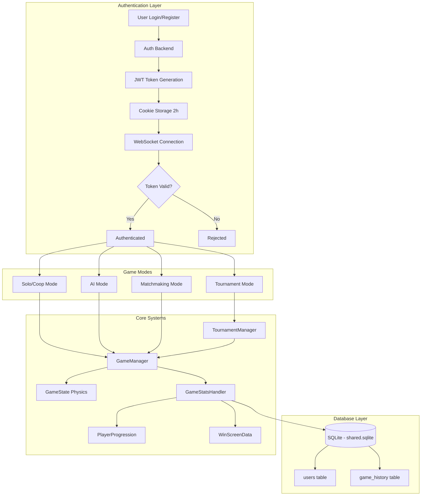

---

## 🔐 Authentication Flow (Detailed)

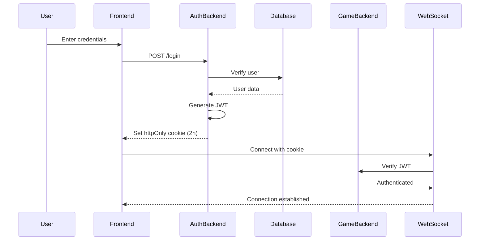

---

## 🎯 Matchmaking Mode Flow

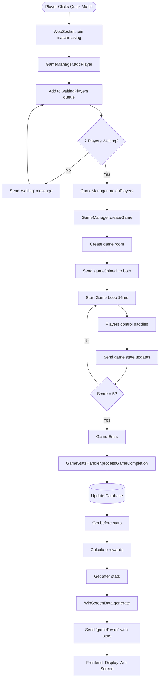

---

## 🏆 Tournament Mode Flow (Complete)

```mermaid
flowchart TD
    Start([Player Clicks Join Tournament]) --> Connect[WebSocket: join tournament]
    Connect --> AddQ[TournamentManager.addPlayerToQueue]
    AddQ --> Queue[playerQueue.push]
    Queue --> Notify1[Send 'tournamentQueued']
    Notify1 --> Check{8 Players?}
    Check -->|No| Wait[Show Queue Screen]
    Wait --> Queue
    Check -->|Yes| StartT[TournamentManager.startTournament]
    
    StartT --> Bracket[Create bracket structure]
    Bracket --> Quarter[Quarter Finals: 4 matches]
    Quarter --> CreateQ[GameManager.createTournamentMatches]
    CreateQ --> Rooms[Create 4 game rooms]
    Rooms --> Ready1[Send 'tournamentMatchReady']
    Ready1 --> Countdown1[Frontend: 3 sec countdown]
    Countdown1 --> Game1[4 Games Running]
    Game1 --> End1{Game Ends}
    End1 --> Process1[processTournamentMatch]
    Process1 --> Record1[recordMatchResult]
    Record1 --> Reward1[calculateRewards: +2RR/+15XP]
    Reward1 --> StatsQ[processGameCompletion]
    StatsQ --> DBQ[(Update Database)]
    DBQ --> WinQ[generateWinScreenData]
    WinQ --> Result1[Send 'tournamentMatchResult']
    Result1 --> Screen1{Winner or Loser?}
    Screen1 -->|Winner| WaitQ[tournamentWaiting 10sec]
    Screen1 -->|Loser| Elim1[Eliminated]
    
    WaitQ --> AllDone1{All 4 Matches Done?}
    AllDone1 -->|No| WaitQ
    AllDone1 -->|Yes| Advance1[advanceTournament]
    
    Advance1 --> Semi[Semi Finals: 2 matches]
    Semi --> CreateS[Create 2 game rooms]
    CreateS --> Ready2[Send 'tournamentMatchReady']
    Ready2 --> Countdown2[Frontend: 3 sec countdown]
    Countdown2 --> Game2[2 Games Running]
    Game2 --> End2{Game Ends}
    End2 --> Process2[processTournamentMatch]
    Process2 --> Record2[recordMatchResult]
    Record2 --> Reward2[calculateRewards: +5RR/+40XP]
    Reward2 --> StatsS[processGameCompletion]
    StatsS --> DBS[(Update Database)]
    DBS --> WinS[generateWinScreenData]
    WinS --> Result2[Send 'tournamentMatchResult']
    Result2 --> Screen2{Winner or Loser?}
    Screen2 -->|Winner| WaitS[tournamentWaiting 10sec]
    Screen2 -->|Loser| Elim2[Eliminated]
    
    WaitS --> AllDone2{Both Matches Done?}
    AllDone2 -->|No| WaitS
    AllDone2 -->|Yes| Advance2[advanceTournament]
    
    Advance2 --> Finals[Finals: 1 match]
    Finals --> CreateF[Create 1 game room]
    CreateF --> Ready3[Send 'tournamentMatchReady']
    Ready3 --> Countdown3[Frontend: 3 sec countdown]
    Countdown3 --> Game3[Championship Game]
    Game3 --> End3{Game Ends}
    End3 --> Process3[processTournamentMatch]
    Process3 --> Record3[recordMatchResult]
    Record3 --> Reward3[calculateRewards: +10RR/+100XP]
    Reward3 --> StatsF[processGameCompletion]
    StatsF --> DBF[(Update Database)]
    DBF --> WinF[generateWinScreenData]
    WinF --> Champion[Send 'tournamentChampion']
    Champion --> Trophy([🏆 Champion Crowned!])
```

---

## 🤖 AI Mode Flow

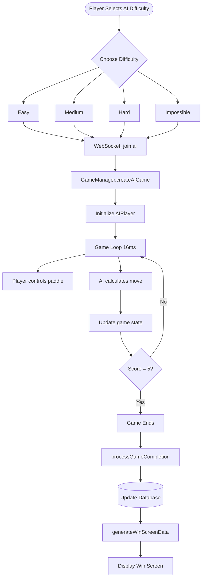

---

## 📊 Stats Update Flow (Detailed)

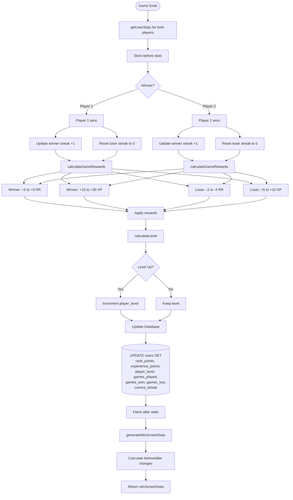

---

## 🗄️ Database Operations

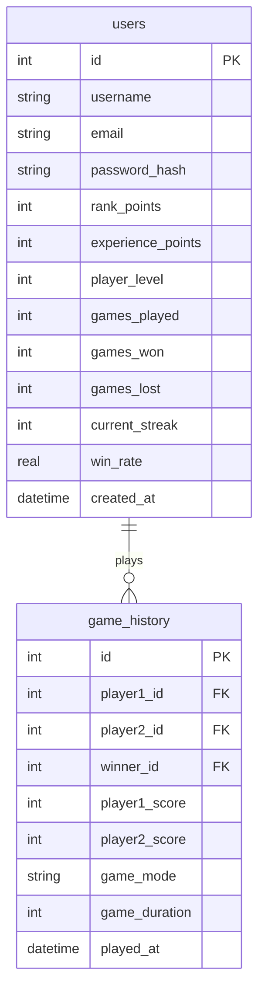

---

## 🔄 WebSocket Message Flow

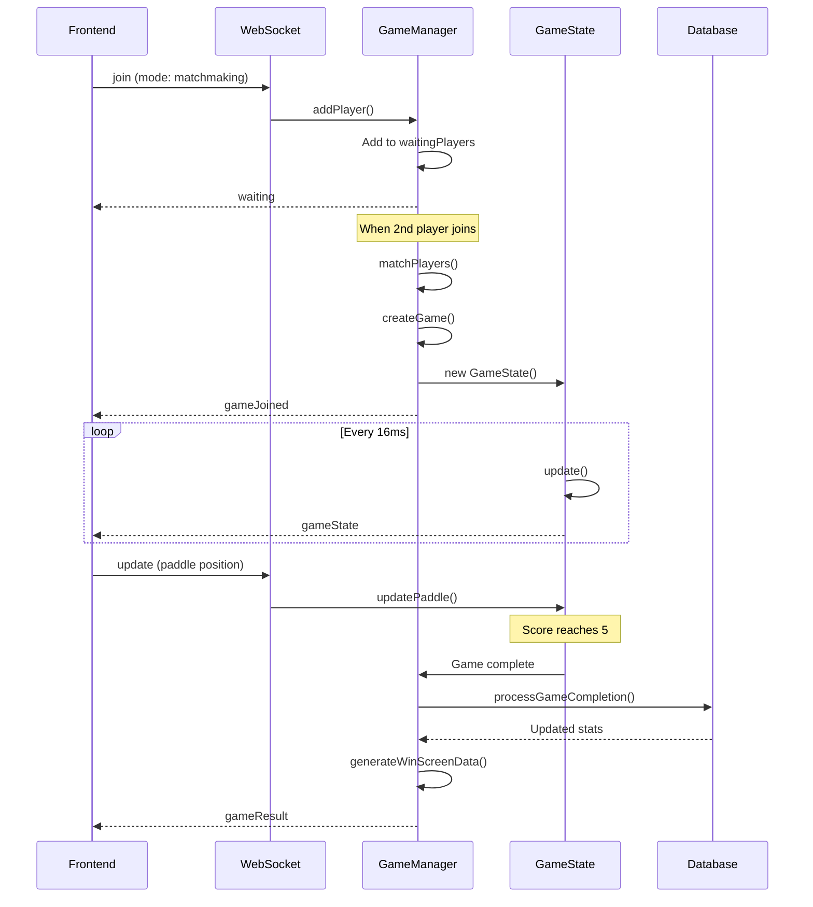

---

## 🎯 Core Component Relationships

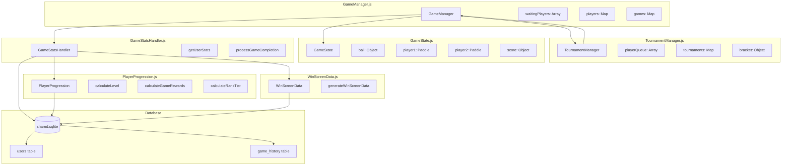

---

## 🏁 Game Loop Architecture

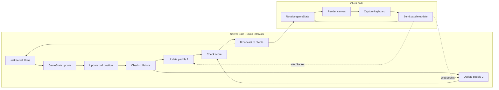

---

## 🎮 Game Mode Decision Tree

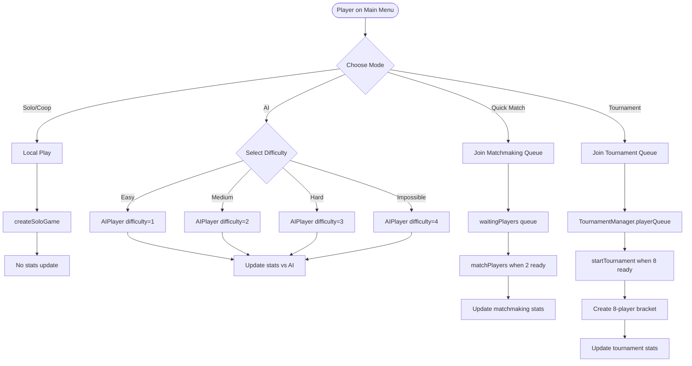

---

## 📈 Level & Rank Progression

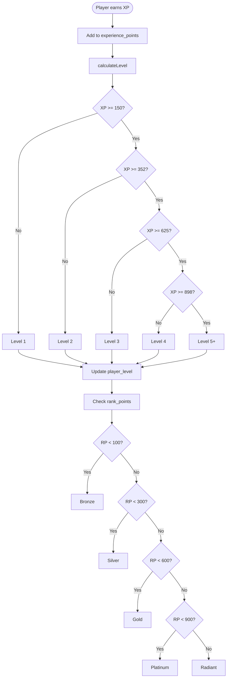

---

## 🐛 Error & Edge Case Handling

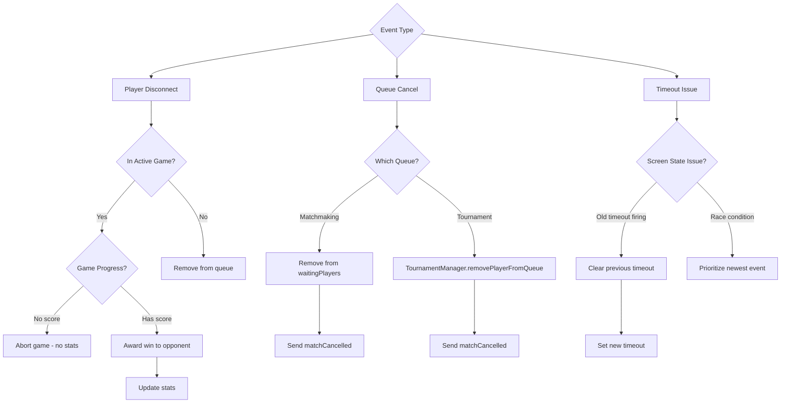

---

Copy any of these diagrams into https://mermaid.live to visualize them interactively!
